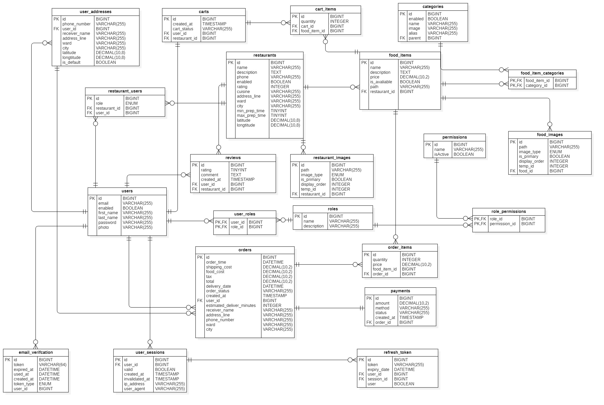

# Hungry Belly

Hungry Belly is a monorepo centered on a Spring Boot backend for authentication, user and role administration, restaurant management, catalog management, storage uploads, and export workflows.

## Repository structure

```text
hungry-belly\
|-- hungry-belly-backend\
|-- hungry-belly-frontend\
|   |-- admin-app\
|   `-- customer-app\
`-- resources\
```

## Backend snapshot

**Location:** `hungry-belly-backend\`

| Area | Current backend behavior |
| --- | --- |
| Authentication | Login, refresh-token rotation, logout, current-user profile, and account update |
| Users | Paginated user management, stats, password reset, status toggle, and export |
| Roles and permissions | Role CRUD, role name lookup, and permission listing |
| Restaurants | Restaurant CRUD, status toggle, member management, and ownership transfer |
| Catalog | Category CRUD, hierarchy view, export, and food CRUD with status toggle |
| Storage | Presigned upload URL generation and temporary upload sessions |
| Operations | Scheduled cleanup of orphaned images and exported files |

## Backend stack

- Java 21
- Spring Boot 3.5.11
- Spring Web, Validation, Security, Data JPA
- MySQL for normal development
- H2 for tests
- JWT authentication with HTTP-only cookies
- Springdoc OpenAPI / Swagger UI
- S3-compatible object storage integration
- Apache POI and Super CSV for export generation

## Backend architecture

The backend follows a package-by-feature structure under `src\main\java\com\eddie\hungry_belly_backend\`, with feature modules such as:

- `auth`
- `user`
- `role`
- `permission`
- `restaurant`
- `restaurantuser`
- `category`
- `food`

Shared packages include `common`, `config`, `entity`, `exception`, `scheduler`, `security`, `session`, and `token`.

## Configuration

The backend imports local environment variables from `hungry-belly-backend\.env`.

Create `hungry-belly-backend\.env` with:

```env
DB_URL=jdbc:mysql://localhost:3306/hungry_belly
DB_USERNAME=
DB_PASSWORD=

BUCKET_NAME=
ACCESS_BUCKET_KEY=
SECRET_BUCKET_KEY=
REGION_NAME=
S3_ENDPOINT=
SIGN_ENDPOINT=
SERVICE_ROLE_KEY=

JWT_SECRET=
```

Notes:

- `JWT_SECRET` must be Base64-encoded because the backend decodes it before signing tokens.
- The API base path is `/api/v1`.
- Local CORS is currently configured for `http://localhost:5173`.
- JPA schema generation is set to `ddl-auto: update`.

## Run the backend

From `hungry-belly-backend\` on Windows:

```powershell
.\mvnw.cmd spring-boot:run
```

Default local URLs:

- API: `http://localhost:8080`
- Swagger UI: `http://localhost:8080/swagger-ui/index.html`

## Build and test

From `hungry-belly-backend\`:

```powershell
.\mvnw.cmd -q test
.\mvnw.cmd -q -DskipTests package
```

Tests use H2 through `src\test\resources\application-test.yaml`.

## API areas

All backend endpoints are served under `/api/v1`.

| Area | Base endpoints |
| --- | --- |
| Auth | `/auth/login`, `/auth/refresh-token`, `/auth/logout`, `/auth/me`, `/auth/update-account` |
| Users | `/users`, `/users/page`, `/users/stats`, `/users/{id}/password`, `/users/{id}/status`, `/users/export/{format}` |
| Roles | `/roles`, `/roles/names`, `/roles/{id}` |
| Permissions | `/permissions` |
| Restaurants | `/restaurants`, `/restaurants/page`, `/restaurants/{id}/status` |
| Restaurant members | `/restaurants/{restaurantId}/members`, `/restaurants/mine`, `/restaurants/{restaurantId}/transfer-ownership` |
| Categories | `/categories`, `/categories/roots`, `/categories/in-form`, `/categories/{id}/status`, `/categories/export/{format}` |
| Foods | `/foods`, `/foods/page`, `/foods/{id}/status` |
| Storage | `/storage/presigned-urls`, `/storage/temp-session` |

Security notes from the current backend configuration:

- `/users/**` and `/roles/**` require the `ADMIN` role.
- `/restaurants/**` and `/foods/**` allow `ADMIN` or `PARTNER`.
- Swagger and auth login/refresh routes are publicly accessible.

## Frontend integration note

The repo also contains:

- `hungry-belly-frontend\admin-app\`
- `hungry-belly-frontend\customer-app\`

For local admin frontend development, point the app to:

```env
VITE_API_URL=http://localhost:8080/api/v1
```

## Docker

`hungry-belly-backend\Dockerfile` builds the backend with Maven and Temurin 21, packages the Spring Boot jar, runs as a non-root user, and exposes port `8080`.

## Database schema


